Flowcharts are composed of **nodes** (geometric shapes) and **edges** (arrows or lines). The Mermaid code defines how nodes and edges are made and accommodates different arrow types, multi-directional arrows, and any linking to and from subgraphs.

<Callout type="warning">
 

 This page is a reference for the Mermaid syntax for flowcharts. For a more detailed explanation of the syntax, visit the [official Mermaid documentation](https://mermaid-js.github.io/mermaid/#/flowchart).
</Callout>


### A node (default)

```mermaid-example
---
title: Node
---
flowchart L
    id
```

<MermaidPreviewMD chart={`
flowchart LR
    id
`}/>

### A node with text

It is also possible to set text in the box that differs from the id. If this is done several times, it is the last text
found for the node that will be used. Also if you define edges for the node later on, you can omit text definitions. The
one previously defined will be used when rendering the box.

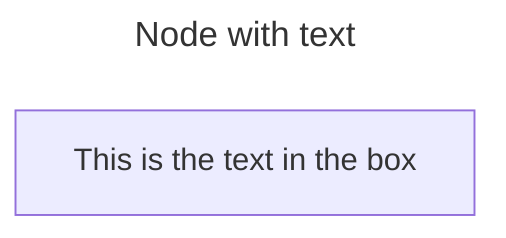
<MermaidPreviewMD chart={`
flowchart LR
    id1[This is the text in the box]
`}/>

#### Unicode text

Use `"` to enclose the unicode text.

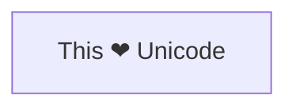

<MermaidPreviewMD chart={`
flowchart LR
    id["This ❤ Unicode"]
`}/>

#### Markdown formatting

Use double quotes and backticks "\` text \`" to enclose the markdown text.

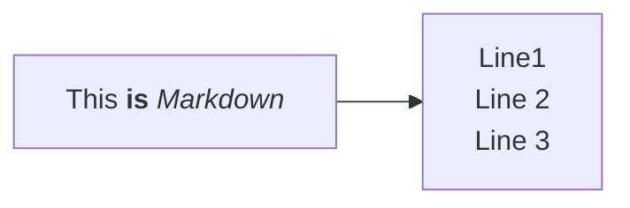

<MermaidPreviewMD chart={`
flowchart LR
   A -- text --> B -- text2 --> C`}/>

### Direction

This statement declares the direction of the Flowchart.

This declares the flowchart is oriented from top to bottom (`TD` or `TB`).

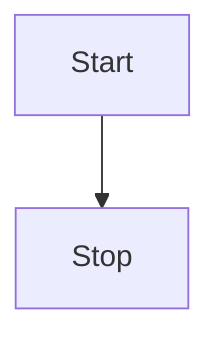

<MermaidPreviewMD chart={`
flowchart LR
    Start --> Stop
`}/>

This declares the flowchart is oriented from left to right (`LR`).

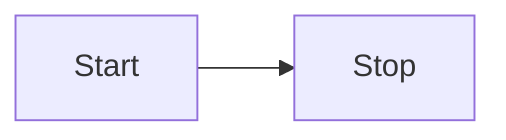

<MermaidPreviewMD chart={`
flowchart LR
    Start --> Stop
`}/>

Possible FlowChart orientations are:

- TB - Top to bottom
- TD - Top-down/ same as top to bottom
- BT - Bottom to top
- RL - Right to left
- LR - Left to right

## Node shapes

### A node with round edges

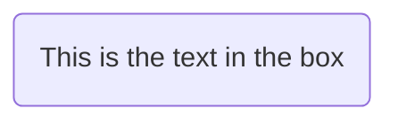

<MermaidPreviewMD chart={`
flowchart LR
    id1(This is the text in the box)
`}/>

### A stadium-shaped node

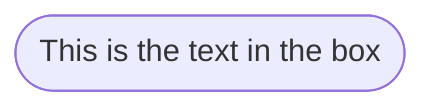

<MermaidPreviewMD chart={`
flowchart LR
    id1([This is the text in the box])
`}/>

### A node in a subroutine shape

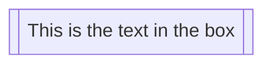

<MermaidPreviewMD chart={`
flowchart LR
    id1[[This is the text in the box]]
`}/>

### A node in a cylindrical shape

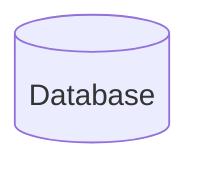
<MermaidPreviewMD chart={`
flowchart LR
    id1[(Database)]
`}/>

### A node in the form of a circle

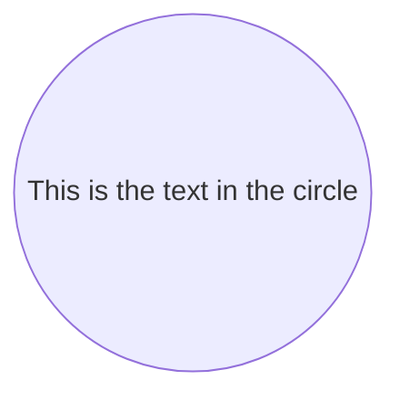

<MermaidPreviewMD chart={`
flowchart LR
    id1((This is the text in the circle))
`}/>

### A node in an asymmetric shape

```mermaid-example
flowchart LR
    id1>This is the text in the box
```

<MermaidPreviewMD chart={`
flowchart LR
    id1>This is the text in the box
`}/>

Currently only the shape above is possible and not its mirror. _This might change with future releases._

### A node (rhombus)

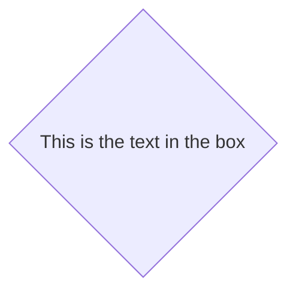

<MermaidPreviewMD chart={`
flowchart LR
    id1{This is the text in the box}
`}/>

### A hexagon node

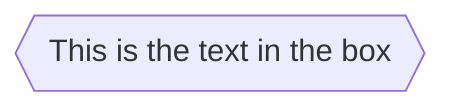

<MermaidPreviewMD chart={`
flowchart LR
    id1{{This is the text in the box}}
`}/>

### Parallelogram

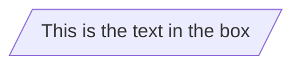

<MermaidPreviewMD chart={`
flowchart TD
    id1[/This is the text in the box/]
`}/>

### Parallelogram alt

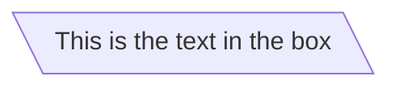

<MermaidPreviewMD chart={`
flowchart TD
    id1[\This is the text in the box\]
`}/>

### Trapezoid

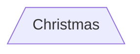

<MermaidPreviewMD chart={`
flowchart TD
    A[/Christmas\]
`}/>

### Trapezoid alt

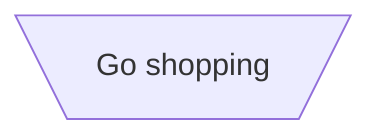

<MermaidPreviewMD chart={`
flowchart TD
    B[\Go shopping/]
`}/>

### Double circle

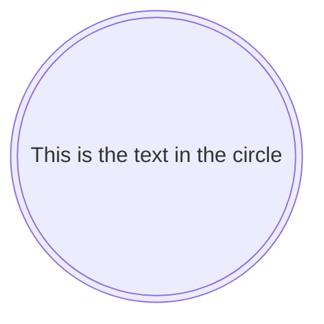

<MermaidPreviewMD chart={`
flowchart TD
    id1(((This is the text in the circle)))
`}/>

## Links between nodes

Nodes can be connected with links/edges. It is possible to have different types of links or attach a text string to a link.

### A link with arrow head

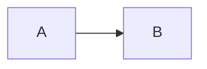

<MermaidPreviewMD chart={`
flowchart LR
    A-->B
`}/>

### An open link

```mermaid-example
flowchart LR
    A --- B
```

<MermaidPreviewMD chart={`
flowchart LR
    A --- B
`}/>

### Text on links

```mermaid-example
flowchart LR
    A-- This is the text! ---B
```

<MermaidPreviewMD chart={`
flowchart LR
    A-- This is the text! ---B
`}/>


### A link with arrow head and text

```mermaid-example
flowchart LR
    A-->|text|B
```

<MermaidPreviewMD chart={`
flowchart LR
    A-->|text|B
`}/>

### Dotted link

```mermaid-example
flowchart LR
   A-.->B;
```

<MermaidPreviewMD chart={`
flowchart LR
   A-.->B;
`}/>

### Dotted link with text

```mermaid-example
flowchart LR
   A-. text .-> B
```

<MermaidPreviewMD chart={`
flowchart LR
   A-. text .-> B
`}/>

### Thick link

```mermaid-example
flowchart LR
   A ==> B
```

<MermaidPreviewMD chart={`
flowchart LR
   A ==> B
`}/>

### Thick link with text

```mermaid-example
flowchart LR
   A == text ==> B
```

<MermaidPreviewMD chart={`
flowchart LR
   A == text ==> B
`}/>

### An invisible link

This can be a useful tool in some instances where you want to alter the default positioning of a node.

```mermaid-example
flowchart LR
    A ~~~ B
```

<MermaidPreviewMD chart={`
flowchart LR
    A ~~~ B
`}/>

### Chaining of links

It is possible declare many links in the same line as per below:

```mermaid-example
flowchart LR
   A -- text --> B -- text2 --> C
```

<MermaidPreviewMD chart={`
flowchart LR
   A -- text --> B -- text2 --> C
`}/>

It is also possible to declare multiple nodes links in the same line as per below:

```mermaid-example
flowchart LR
   a --> b & c--> d
```

<MermaidPreviewMD chart={`
flowchart LR
   a --> b & c--> d
`}/>

You can then describe dependencies in a very expressive way. Like the one-liner below:

```mermaid-example
flowchart TB
    A & B--> C & D
```

<MermaidPreviewMD chart={`
flowchart TB
    A & B--> C & D
`}/>

If you describe the same diagram using the basic syntax, it will take four lines. A
word of warning, one could go overboard with this making the flowchart harder to read in
markdown form. The Swedish word `lagom` comes to mind. It means, not too much and not too little.
This goes for expressive syntaxes as well.

```mermaid
flowchart TB
    A --> C
    A --> D
    B --> C
    B --> D
```

## New arrow types

There are new types of arrows supported:

- circle edge
- cross edge

### Circle edge example

```mermaid-example
flowchart LR
    A --o B
```

<MermaidPreviewMD chart={`
flowchart LR
    A --o B
`}/>

### Cross edge example

```mermaid-example
flowchart LR
    A --x B
```

<MermaidPreviewMD chart={`
flowchart LR
    A --x B
`}/>

## Multi directional arrows

There is the possibility to use multidirectional arrows.

```mermaid-example
flowchart LR
    A o--o B
    B <--> C
    C x--x D
```

<MermaidPreviewMD chart={`
flowchart LR
    A o--o B
    B <--> C
    C x--x D
`}/>

### Minimum length of a link

Each node in the flowchart is ultimately assigned to a rank in the rendered
graph, i.e. to a vertical or horizontal level (depending on the flowchart
orientation), based on the nodes to which it is linked. By default, links
can span any number of ranks, but you can ask for any link to be longer
than the others by adding extra dashes in the link definition.

In the following example, two extra dashes are added in the link from node _B_
to node _E_, so that it spans two more ranks than regular links:

```mermaid-example
flowchart TD
    A[Start] --> B{Is it?}
    B -->|Yes| C[OK]
    C --> D[Rethink]
    D --> B
    B ---->|No| E[End]
```

> **Note** Links may still be made longer than the requested number of ranks
> by the rendering engine to accommodate other requests.

When the link label is written in the middle of the link, the extra dashes must
be added on the right side of the link. The following example is equivalent to
the previous one:

```mermaid-example
flowchart TD
    A[Start] --> B{Is it?}
    B -- Yes --> C[OK]
    C --> D[Rethink]
    D --> B
    B -- No ----> E[End]
```

<MermaidPreviewMD chart={`
flowchart TD
    A[Start] --> B{Is it?}
    B -- Yes --> C[OK]
    C --> D[Rethink]
    D --> B
    B -- No ----> E[End]
`}/>

For dotted or thick links, the characters to add are equals signs or dots,
as summed up in the following table:

| Length            |   1    |    2    |    3     |
| ----------------- | :----: | :-----: | :------: |
| Normal            | `---`  | `----`  | `-----`  |
| Normal with arrow | `-->`  | `--->`  | `---->`  |
| Thick             | `===`  | `====`  | `=====`  |
| Thick with arrow  | `==>`  | `===>`  | `====>`  |
| Dotted            | `-.-`  | `-..-`  | `-...-`  |
| Dotted with arrow | `-.->` | `-..->` | `-...->` |


## Subgraphs

```mermaid
subgraph title
    graph definition
end
```


An example below:

```mermaid-example
flowchart TB
    c1-->a2
    subgraph one
    a1-->a2
    end
    subgraph two
    b1-->b2
    end
    subgraph three
    c1-->c2
    end
```

<MermaidPreviewMD chart={`
flowchart TB
    c1-->a2
    subgraph one
    a1-->a2
    end
    subgraph two
    b1-->b2
    end
    subgraph three
    c1-->c2
    end
`}/>

You can also set an explicit id for the subgraph.

```mermaid-example
flowchart TB
    c1-->a2
    subgraph ide1 [one]
    a1-->a2
    end
```

<MermaidPreviewMD chart={`
flowchart TB
    c1-->a2
    subgraph ide1 [one]
    a1-->a2
    end
`}/>

### flowcharts

With the graphtype flowchart it is also possible to set edges to and from subgraphs as in the flowchart below.

```mermaid-example
flowchart TB
    c1-->a2
    subgraph one
    a1-->a2
    end
    subgraph two
    b1-->b2
    end
    subgraph three
    c1-->c2
    end
    one --> two
    three --> two
    two --> c2
```

<MermaidPreviewMD chart={`
flowchart TB
    c1-->a2
    subgraph one
    a1-->a2
    end
    subgraph two
    b1-->b2
    end
    subgraph three
    c1-->c2
    end
    one --> two
    three --> two
    two --> c2
`}/>

### Direction in subgraphs

With the graphtype flowcharts you can use the direction statement to set the direction which the subgraph will render like in this example.

```mermaid-example
flowchart LR
  subgraph TOP
    direction TB
    subgraph B1
        direction RL
        i1 -->f1
    end
    subgraph B2
        direction BT
        i2 -->f2
    end
  end
  A --> TOP --> B
  B1 --> B2
```

<MermaidPreviewMD chart={`
flowchart LR
  subgraph TOP
    direction TB
    subgraph B1
        direction RL
        i1 -->f1
    end
    subgraph B2
        direction BT
        i2 -->f2
    end
  end
  A --> TOP --> B
  B1 --> B2
`}/>

#### Limitation

If any of a subgraph's nodes are linked to the outside, subgraph direction will be ignored. Instead the subgraph will inherit the direction of the parent graph:

```mermaid-example
flowchart LR
    subgraph subgraph1
        direction TB
        top1[top] --> bottom1[bottom]
    end
    subgraph subgraph2
        direction TB
        top2[top] --> bottom2[bottom]
    end
    %% ^ These subgraphs are identical, except for the links to them:

    %% Link *to* subgraph1: subgraph1 direction is maintained
    outside --> subgraph1
    %% Link *within* subgraph2:
    %% subgraph2 inherits the direction of the top-level graph (LR)
    outside ---> top2
```

<MermaidPreviewMD chart={`
flowchart LR
    subgraph subgraph1
        direction TB
        top1[top] --> bottom1[bottom]
    end
    subgraph subgraph2
        direction TB
        top2[top] --> bottom2[bottom]
    end
    %% ^ These subgraphs are identical, except for the links to them:

    %% Link *to* subgraph1: subgraph1 direction is maintained
    outside --> subgraph1
    %% Link *within* subgraph2:
    %% subgraph2 inherits the direction of the top-level graph (LR)
    outside ---> top2
`}/>


### Comments

Comments can be entered within a flow diagram, which will be ignored by the parser. Comments need to be on their own line, and must be prefaced with `%%` (double percent signs). Any text after the start of the comment to the next newline will be treated as a comment, including any flow syntax

```mermaid
flowchart LR
%% this is a comment A -- text --> B{node}
   A -- text --> B -- text2 --> C
```

<MermaidPreviewMD chart={`
flowchart LR
%% this is a comment A -- text --> B{node}
   A -- text --> B -- text2 --> C
`}/>

## Styling and classes

### Styling links

It is possible to style links. For instance, you might want to style a link that is going backwards in the flow. As links
have no ids in the same way as nodes, some other way of deciding what style the links should be attached to is required.
Instead of ids, the order number of when the link was defined in the graph is used, or use default to apply to all links.
In the example below the style defined in the linkStyle statement will belong to the fourth link in the graph:

```mermaid
linkStyle 3 stroke:#ff3,stroke-width:4px,color:red;
```

It is also possible to add style to multiple links in a single statement, by separating link numbers with commas:

```mermaid
linkStyle 1,2,7 color:blue;
```

### Styling line curves

It is possible to style the type of curve used for lines between items, if the default method does not meet your needs.
Available curve styles include `basis`, `bumpX`, `bumpY`, `cardinal`, `catmullRom`, `linear`, `monotoneX`, `monotoneY`,
`natural`, `step`, `stepAfter`, and `stepBefore`.

In this example, a left-to-right graph uses the `stepBefore` curve style:


### Styling a node

It is possible to apply specific styles such as a thicker border or a different background color to a node.

```mermaid-example
flowchart LR
    id1(Start)-->id2(Stop)
    style id1 fill:#f9f,stroke:#333,stroke-width:4px
    style id2 fill:#bbf,stroke:#f66,stroke-width:2px,color:#fff,stroke-dasharray: 5 5
```

<MermaidPreviewMD chart={`
flowchart LR
    id1(Start)-->id2(Stop)
    style id1 fill:#f9f,stroke:#333,stroke-width:4px
    style id2 fill:#bbf,stroke:#f66,stroke-width:2px,color:#fff,stroke-dasharray: 5 5
`}/>

#### Classes

More convenient than defining the style every time is to define a class of styles and attach this class to the nodes that
should have a different look.

A class definition looks like the example below:

```mermaid
    classDef className fill:#f9f,stroke:#333,stroke-width:4px;
```

Also, it is possible to define style to multiple classes in one statement:

```mermaid
    classDef firstClassName,secondClassName font-size:12pt;
```

Attachment of a class to a node is done as per below:

```mermaid
    class nodeId1 className;
```

It is also possible to attach a class to a list of nodes in one statement:

```mermaid
    class nodeId1,nodeId2 className;
```

A shorter form of adding a class is to attach the classname to the node using the `:::`operator as per below:

```mermaid-example
flowchart LR
    A:::someclass --> B
    classDef someclass fill:#f96
```

<MermaidPreviewMD chart={`
flowchart LR
    A:::someclass --> B
    classDef someclass fill:#f96
`}/>

This form can be used when declaring multiple links between nodes:

```mermaid-example
flowchart LR
    A:::foo & B:::bar --> C:::foobar
    classDef foo stroke:#f00
    classDef bar stroke:#0f0
    classDef foobar stroke:#00f
```

<MermaidPreviewMD chart={`
flowchart LR
    A:::foo & B:::bar --> C:::foobar
    classDef foo stroke:#f00
    classDef bar stroke:#0f0
    classDef foobar stroke:#00f
`}/>