A Sequence diagram is an interaction diagram that shows how processes operate with one another and in what order.

<Callout type="warning">
  This page is a reference for the Mermaid syntax for sequence diagrams. For a more detailed explanation of the syntax, visit the [official Mermaid documentation](https://mermaid.js.org/syntax/sequenceDiagram.html).
</Callout>


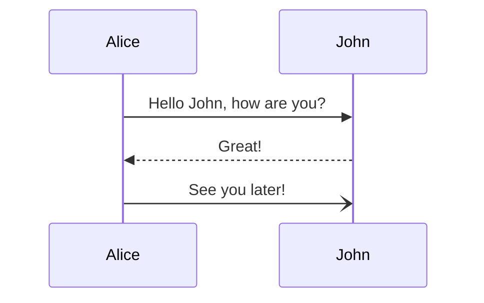

<MermaidPreviewMD chart={`
sequenceDiagram
    Alice->>John: Hello John, how are you?
    John-->>Alice: Great!
    Alice-)John: See you later!
`}/>


## Syntax

### Participants

The participants can be defined implicitly as in the first example on this page. The participants or actors are
rendered in order of appearance in the diagram source text. Sometimes you might want to show the participants in a
different order than how they appear in the first message. It is possible to specify the actor's order of
appearance by doing the following:

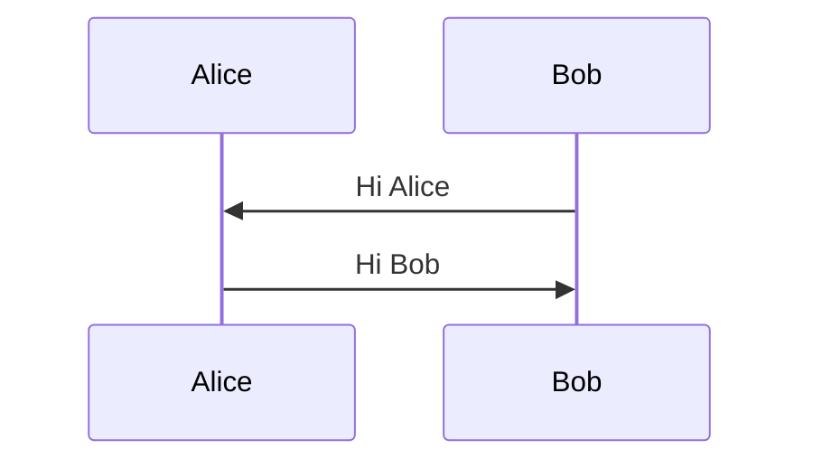

<MermaidPreviewMD chart={`
sequenceDiagram
    participant Alice
    participant Bob
    Bob->>Alice: Hi Alice
    Alice->>Bob: Hi Bob
`}/>

### Actors

If you specifically want to use the actor symbol instead of a rectangle with text you can do so by using actor statements as per below.

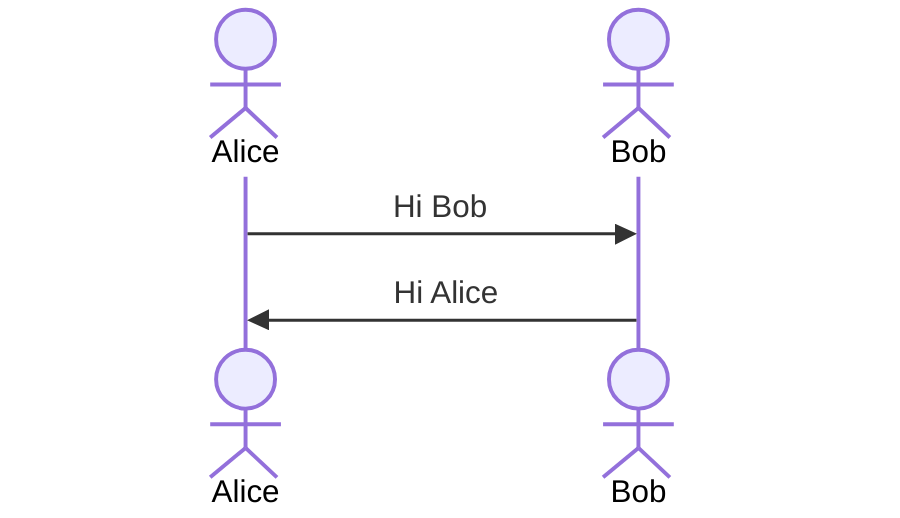

<MermaidPreviewMD chart={`
sequenceDiagram
    actor Alice
    actor Bob
    Alice->>Bob: Hi Bob
    Bob->>Alice: Hi Alice
`}/>

### Aliases

The actor can have a convenient identifier and a descriptive label.

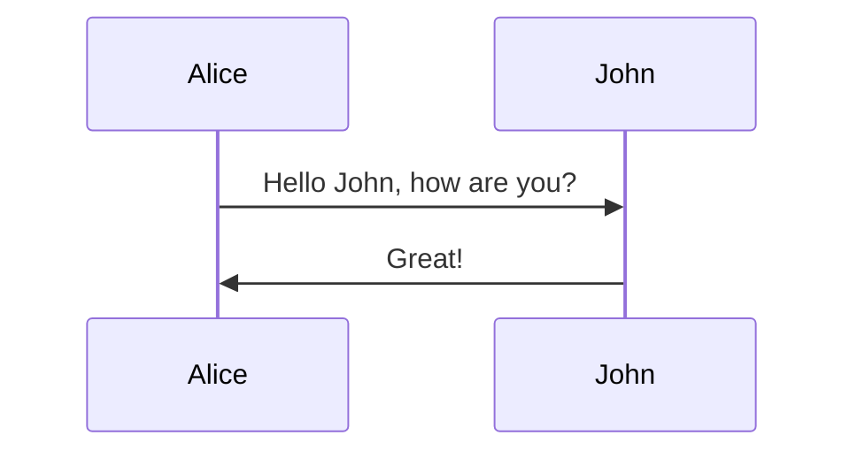

<MermaidPreviewMD chart={`
sequenceDiagram
    participant A as Alice
    participant J as John
    A->>J: Hello John, how are you?
    J->>A: Great!
`}/>

### Actor Creation and Destruction

It is possible to create and destroy actors by messages. To do so, add a create or destroy directive before the message.

```mermaid
create participant B
A --> B: Hello
```

Create directives support actor/participant distinction and aliases. The sender or the recipient of a message can be destroyed but only the recipient can be created.

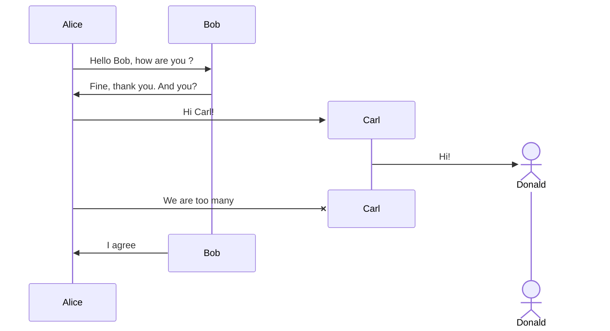

<MermaidPreviewMD chart={`
sequenceDiagram
    Alice->>Bob: Hello Bob, how are you ?
    Bob->>Alice: Fine, thank you. And you?
    create participant Carl
    Alice->>Carl: Hi Carl!
    create actor D as Donald
    Carl->>D: Hi!
    destroy Carl
    Alice-xCarl: We are too many
    destroy Bob
    Bob->>Alice: I agree
`}/>

#### Unfixable actor/participant creation/deletion error

If an error of the following type occurs when creating or deleting an actor/participant:

> The destroyed participant **participant-name** does not have an associated destroying message after its declaration. Please check the sequence diagram.

And fixing diagram code does not get rid of this error and rendering of all other diagrams results in the same error, then you need to update the mermaid version to (v10.7.0+).

### Grouping / Box

The actor(s) can be grouped in vertical boxes. You can define a color (if not, it will be transparent) and/or a descriptive label using the following notation:

```mermaid
box Aqua Group Description
... actors ...
end
box Group without description
... actors ...
end
box rgb(33,66,99)
... actors ...
end
```


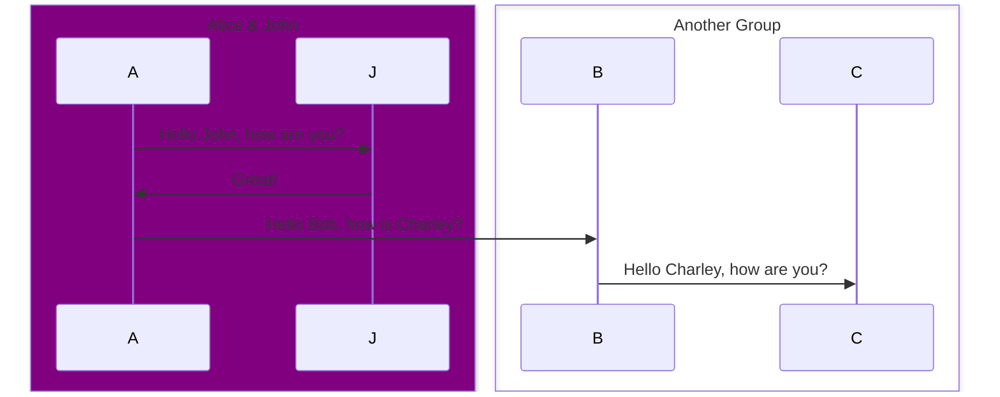

<MermaidPreviewMD chart={`
sequenceDiagram
    box Purple Alice & John
    participant A
    participant J
    end
    box Another Group
    participant B
    participant C
    end
    A->>J: Hello John, how are you?
    J->>A: Great!
    A->>B: Hello Bob, how is Charley?
    B->>C: Hello Charley, how are you?
`}/>

## Messages

Messages can be of two displayed either solid or with a dotted line.

```mermaid
[Actor][Arrow][Actor]:Message text
```


There are six types of arrows currently supported:

| Type   | Description                                      |
| ------ | ------------------------------------------------ |
| `->`   | Solid line without arrow                         |
| `-->`  | Dotted line without arrow                        |
| `->>`  | Solid line with arrowhead                        |
| `-->>` | Dotted line with arrowhead                       |
| `-x`   | Solid line with a cross at the end               |
| `--x`  | Dotted line with a cross at the end.             |
| `-)`   | Solid line with an open arrow at the end (async) |
| `--)`  | Dotted line with a open arrow at the end (async) |

## Activations

It is possible to activate and deactivate an actor. (de)activation can be dedicated declarations:

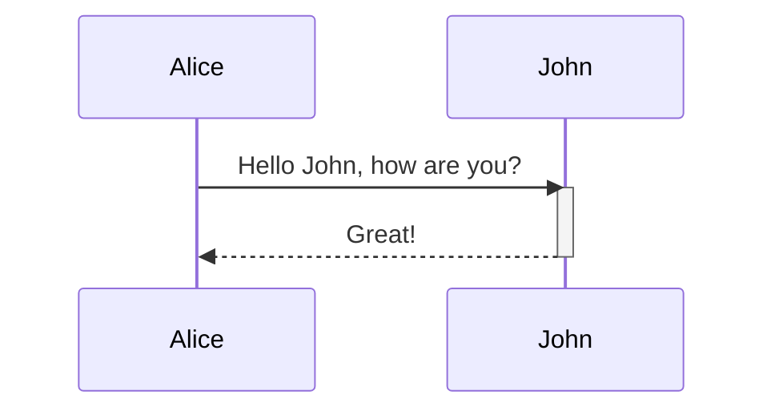

<MermaidPreviewMD chart={`
sequenceDiagram
    Alice->>John: Hello John, how are you?
    activate John
    John-->>Alice: Great!
    deactivate John
`}/>

There is also a shortcut notation by appending `+`/`-` suffix to the message arrow:

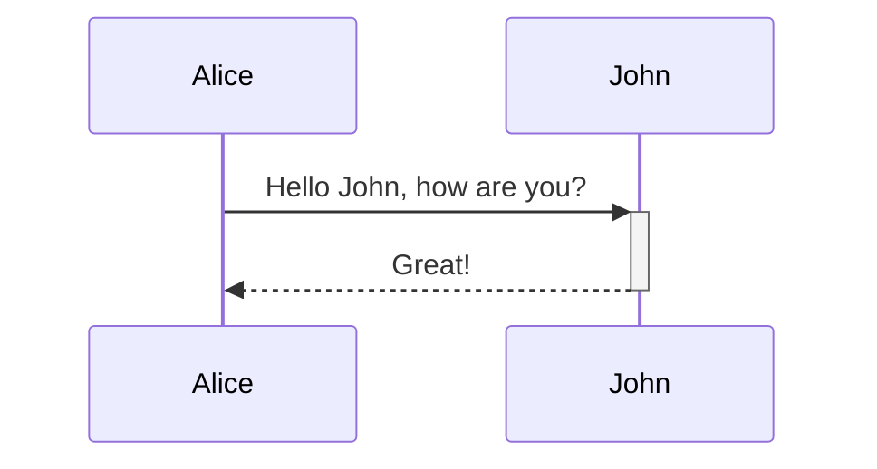

<MermaidPreviewMD chart={`
sequenceDiagram
    Alice->>+John: Hello John, how are you?
    John-->>-Alice: Great!
`}/>

Activations can be stacked for same actor:

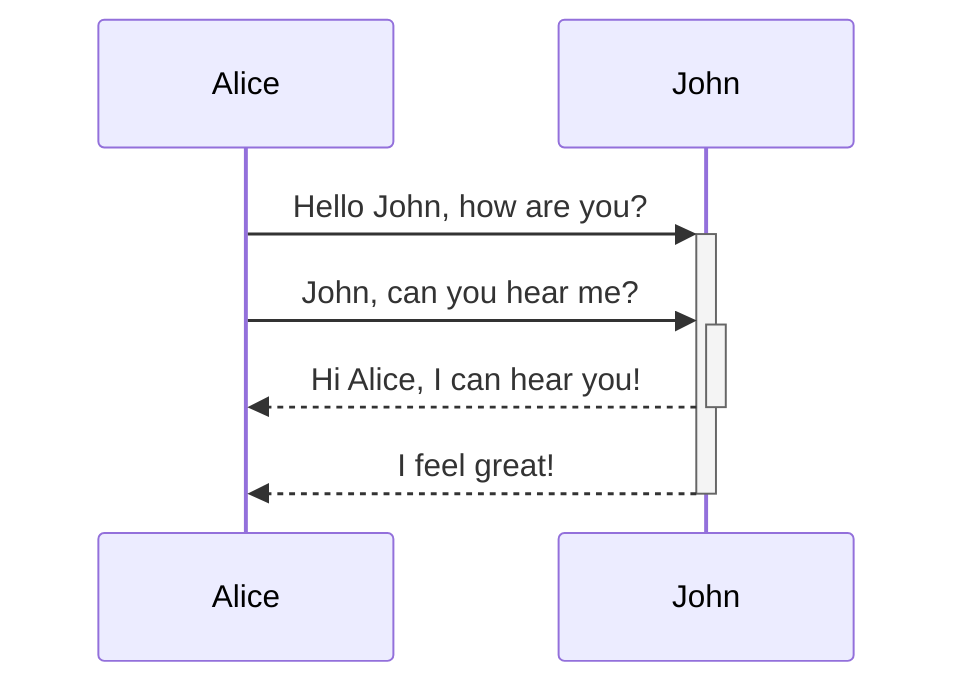

<MermaidPreviewMD chart={`
sequenceDiagram
    Alice->>+John: Hello John, how are you?
    Alice->>+John: John, can you hear me?
    John-->>-Alice: Hi Alice, I can hear you!
    John-->>-Alice: I feel great!
`}/>

## Notes

It is possible to add notes to a sequence diagram. This is done by the notation
Note [ right of | left of | over ] [Actor]: Text in note content

See the example below:

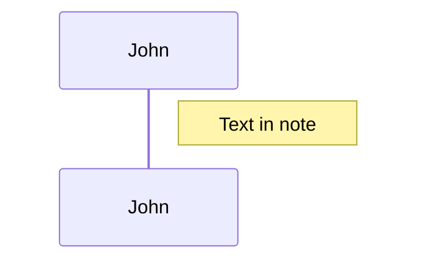

<MermaidPreviewMD chart={`
sequenceDiagram
    participant John
    Note right of John: Text in note
`}/>

It is also possible to create notes spanning two participants:

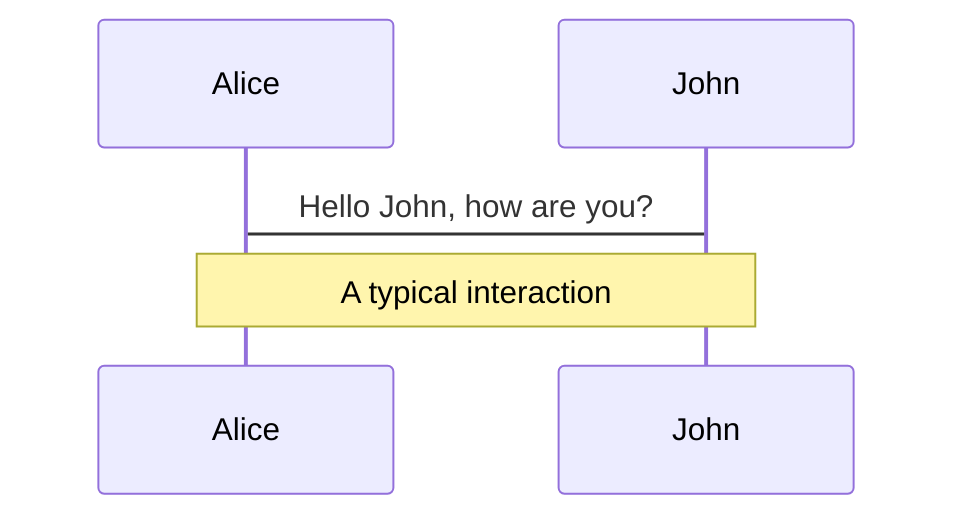

<MermaidPreviewMD chart={`
sequenceDiagram
    Alice->John: Hello John, how are you?
    Note over Alice,John: A typical interaction
`}/>

It is also possible to add a line break (applies to text input in general):

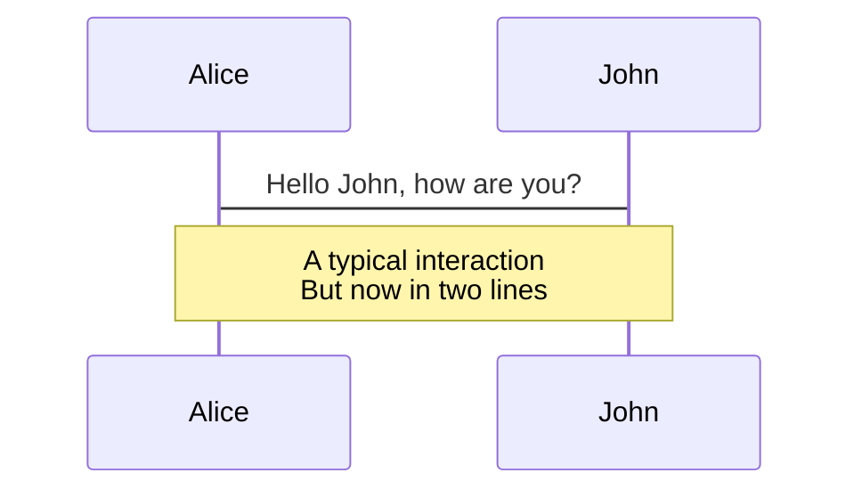

<MermaidPreviewMD chart={`
sequenceDiagram
    Alice->John: Hello John, how are you?
    Note over Alice,John: A typical interaction<br/>But now in two lines
`}/>

## Loops

It is possible to express loops in a sequence diagram. This is done by the notation

```mermaid
loop Loop text
... statements ...
end
```

See the example below:

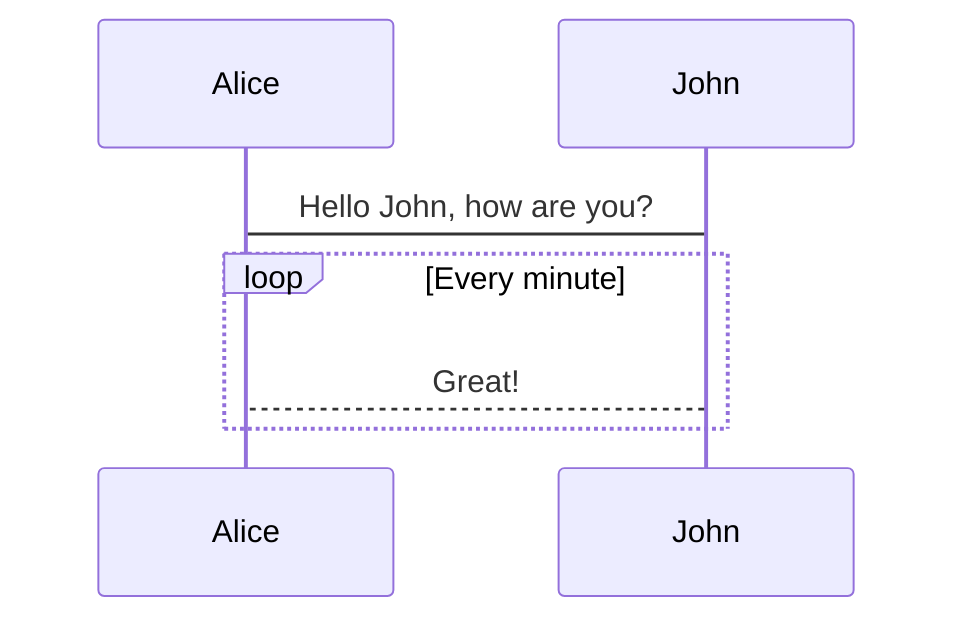

<MermaidPreviewMD chart={`
sequenceDiagram
    Alice->John: Hello John, how are you?
    loop Every minute
        John-->Alice: Great!
    end
`}/>

## Alt

It is possible to express alternative paths in a sequence diagram. This is done by the notation

```mermaid
alt Describing text
... statements ...
else
... statements ...
end
```


or if there is sequence that is optional (if without else).

```mermaid
opt Describing text
... statements ...
end
```

See the example below:

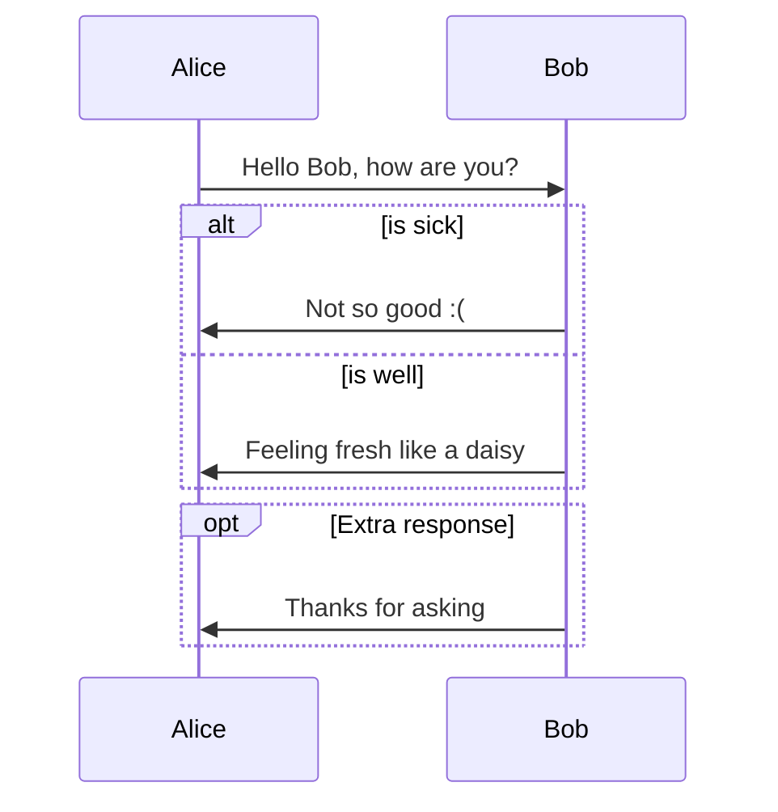

<MermaidPreviewMD chart={`
sequenceDiagram
    Alice->>Bob: Hello Bob, how are you?
    alt is sick
        Bob->>Alice: Not so good :(
    else is well
        Bob->>Alice: Feeling fresh like a daisy
    end
    opt Extra response
        Bob->>Alice: Thanks for asking
    end
`}/>

## Parallel

It is possible to show actions that are happening in parallel.

This is done by the notation

```mermaid
par [Action 1]
... statements ...
and [Action 2]
... statements ...
and [Action N]
... statements ...
end
```

See the example below:

```mermaid-example
sequenceDiagram
    par Alice to Bob
        Alice->>Bob: Hello guys!
    and Alice to John
        Alice->>John: Hello guys!
    end
    Bob-->>Alice: Hi Alice!
    John-->>Alice: Hi Alice!
```

<MermaidPreviewMD chart={`
sequenceDiagram
    par Alice to Bob
        Alice->>Bob: Hello guys!
    and Alice to John
        Alice->>John: Hello guys!
    end
    Bob-->>Alice: Hi Alice!
    John-->>Alice: Hi Alice!
`}/>

It is also possible to nest parallel blocks.

```mermaid-example
sequenceDiagram
    par Alice to Bob
        Alice->>Bob: Go help John
    and Alice to John
        Alice->>John: I want this done today
        par John to Charlie
            John->>Charlie: Can we do this today?
        and John to Diana
            John->>Diana: Can you help us today?
        end
    end
```

<MermaidPreviewMD chart={`
sequenceDiagram
    par Alice to Bob
        Alice->>Bob: Go help John
    and Alice to John
        Alice->>John: I want this done today
        par John to Charlie
            John->>Charlie: Can we do this today?
        and John to Diana
            John->>Diana: Can you help us today?
        end
    end
`}/>

## Critical Region

It is possible to show actions that must happen automatically with conditional handling of circumstances.

This is done by the notation

```mermaid
critical [Action that must be performed]
... statements ...
option [Circumstance A]
... statements ...
option [Circumstance B]
... statements ...
end
```

See the example below:

```mermaid-example
sequenceDiagram
    critical Establish a connection to the DB
        Service-->DB: connect
    option Network timeout
        Service-->Service: Log error
    option Credentials rejected
        Service-->Service: Log different error
    end
```

<MermaidPreviewMD chart={`
sequenceDiagram
    critical Establish a connection to the DB
        Service-->DB: connect
    option Network timeout
        Service-->Service: Log error
    option Credentials rejected
        Service-->Service: Log different error
    end
`}/>

It is also possible to have no options at all

```mermaid-example
sequenceDiagram
    critical Establish a connection to the DB
        Service-->DB: connect
    end
```

<MermaidPreviewMD chart={`
sequenceDiagram
    critical Establish a connection to the DB
        Service-->DB: connect
    end
`}/>

This critical block can also be nested, equivalently to the `par` statement as seen above.

## Break

It is possible to indicate a stop of the sequence within the flow (usually used to model exceptions).

This is done by the notation

```mermaid
break [something happened]
... statements ...
end
```

See the example below:

```mermaid-example
sequenceDiagram
    Consumer-->API: Book something
    API-->BookingService: Start booking process
    break when the booking process fails
        API-->Consumer: show failure
    end
    API-->BillingService: Start billing process
```

<MermaidPreviewMD chart={`
sequenceDiagram
    Consumer-->API: Book something
    API-->BookingService: Start booking process
    break when the booking process fails
        API-->Consumer: show failure
    end
    API-->BillingService: Start billing process
`}/>

## Background Highlighting

It is possible to highlight flows by providing colored background rects. This is done by the notation

The colors are defined using rgb and rgba syntax.

```mermaid
rect rgb(0, 255, 0)
... content ...
end
```

```mermaid
rect rgba(0, 0, 255, .1)
... content ...
end
```

See the examples below:

```mermaid-example
sequenceDiagram
    participant Alice
    participant John

    rect rgb(191, 223, 255)
    note right of Alice: Alice calls John.
    Alice->>+John: Hello John, how are you?
    rect rgb(200, 150, 255)
    Alice->>+John: John, can you hear me?
    John-->>-Alice: Hi Alice, I can hear you!
    end
    John-->>-Alice: I feel great!
    end
    Alice ->>+ John: Did you want to go to the game tonight?
    John -->>- Alice: Yeah! See you there.

```

<MermaidPreviewMD chart={`
sequenceDiagram
    participant Alice
    participant John

    rect rgb(191, 223, 255)
    note right of Alice: Alice calls John.
    Alice->>+John: Hello John, how are you?
    rect rgb(200, 150, 255)
    Alice->>+John: John, can you hear me?
    John-->>-Alice: Hi Alice, I can hear you!
    end
    John-->>-Alice: I feel great!
    end
    Alice ->>+ John: Did you want to go to the game tonight?
    John -->>- Alice: Yeah! See you there.
`}/>

## Comments

Comments can be entered within a sequence diagram, which will be ignored by the parser. Comments need to be on their own line, and must be prefaced with `%%` (double percent signs). Any text after the start of the comment to the next newline will be treated as a comment, including any diagram syntax

```mermaid
sequenceDiagram
    Alice->>John: Hello John, how are you?
    %% this is a comment
    John-->>Alice: Great!
```

<MermaidPreviewMD chart={`
sequenceDiagram
    Alice->>John: Hello John, how are you?
    %% this is a comment
    John-->>Alice: Great!
`}/>

## Entity codes to escape characters

It is possible to escape characters using the syntax exemplified here.

```mermaid-example
sequenceDiagram
    A->>B: I #9829; you!
    B->>A: I #9829; you #infin; times more!
```

<MermaidPreviewMD chart={`
sequenceDiagram
    A->>B: I #9829; you!
    B->>A: I #9829; you #infin; times more!
`}/>

Numbers given are base 10, so `#` can be encoded as `#35;`. It is also supported to use HTML character names.

Because semicolons can be used instead of line breaks to define the markup, you need to use `#59;` to include a semicolon in message text.


## Actor Menus

Actors can have popup-menus containing individualized links to external pages. For example, if an actor represented a web service, useful links might include a link to the service health dashboard, repo containing the code for the service, or a wiki page describing the service.

This can be configured by adding one or more link lines with the format:

```mermaid
link <actor>: <link-label> @ <link-url>
```

```mermaid
sequenceDiagram
    participant Alice
    participant John
    link Alice: Dashboard @ https://dashboard.contoso.com/alice
    link Alice: Wiki @ https://wiki.contoso.com/alice
    link John: Dashboard @ https://dashboard.contoso.com/john
    link John: Wiki @ https://wiki.contoso.com/john
    Alice->>John: Hello John, how are you?
    John-->>Alice: Great!
    Alice-)John: See you later!
```

<MermaidPreviewMD chart={`
sequenceDiagram
    participant Alice
    participant John
    link Alice: Dashboard @ https://dashboard.contoso.com/alice
    link Alice: Wiki @ https://wiki.contoso.com/alice
    link John: Dashboard @ https://dashboard.contoso.com/john
    link John: Wiki @ https://wiki.contoso.com/john
    Alice->>John: Hello John, how are you?
    John-->>Alice: Great!
    Alice-)John: See you later!
`}/>

