> "A state diagram is a type of diagram used in computer science and related fields to describe the behavior of systems.
> State diagrams require that the system described is composed of a finite number of states; sometimes, this is indeed the
> case, while at other times this is a reasonable abstraction." Wikipedia

Mermaid can render state diagrams. The syntax tries to be compliant with the syntax used in plantUml as this will make
it easier for users to share diagrams between mermaid and plantUml.

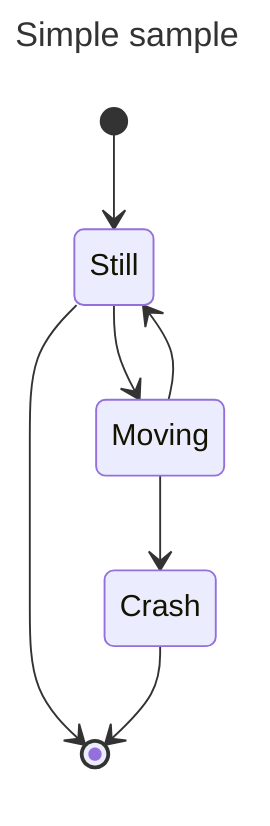

<MermaidPreviewMD chart={`
stateDiagram-v2
    [*] --> Still
    Still --> [*]

    Still --> Moving
    Moving --> Still
    Moving --> Crash
    Crash --> [*]
`}/>

In state diagrams systems are described in terms of _states_ and how one _state_ can change to another _state_ via
a _transition._ The example diagram above shows three states: **Still**, **Moving** and **Crash**. You start in the
**Still** state. From **Still** you can change to the **Moving** state. From **Moving** you can change either back to the **Still** state or to
the **Crash** state. There is no transition from **Still** to **Crash**. (You can't crash if you're still.)

## States

A state can be declared in multiple ways. The simplest way is to define a state with just an id:

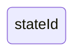

<MermaidPreviewMD chart={`
stateDiagram-v2
    stateId
`}/>

Another way is by using the state keyword with a description as per below:

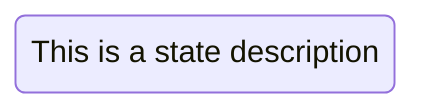

<MermaidPreviewMD chart={`
stateDiagram-v2
    state "This is a state description" as s2
`}/>

Another way to define a state with a description is to define the state id followed by a colon and the description:

<MermaidPreviewMD chart={`
stateDiagram-v2
    s2 : This is a state description
`}/>

## Transitions

Transitions are path/edges when one state passes into another. This is represented using text arrow, "\-\-\>".

When you define a transition between two states and the states are not already defined, the undefined states are defined
with the id from the transition. You can later add descriptions to states defined this way.

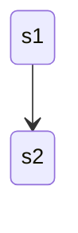

<MermaidPreviewMD chart={`
stateDiagram-v2
    s1 --> s2
`}/>

It is possible to add text to a transition to describe what it represents:

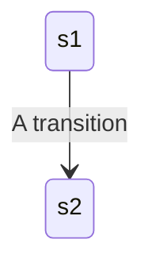

<MermaidPreviewMD chart={`
stateDiagram-v2
    s1 --> s2: A transition
`}/>

## Start and End

There are two special states indicating the start and stop of the diagram. These are written with the [\*] syntax and
the direction of the transition to it defines it either as a start or a stop state.

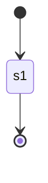

<MermaidPreviewMD chart={`
stateDiagram-v2
    [*] --> s1
    s1 --> [*]
`}/>

## Composite states

In a real world use of state diagrams you often end up with diagrams that are multidimensional as one state can
have several internal states. These are called composite states in this terminology.

In order to define a composite state you need to use the state keyword followed by an id and the body of the composite
state between \{\}. See the example below:

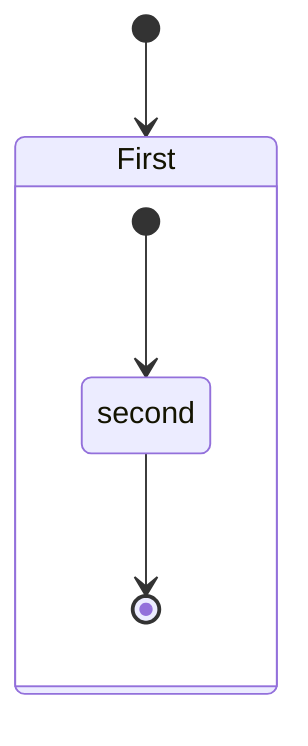

<MermaidPreviewMD chart={`
stateDiagram-v2
    [*] --> First
    state First {
        [*] --> second
        second --> [*]
    }
`}/>

You can do this in several layers:

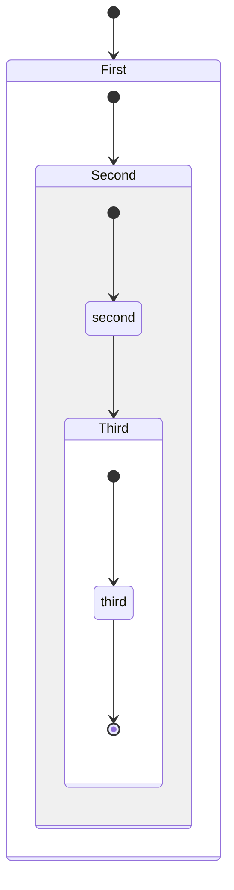

<MermaidPreviewMD chart={`
stateDiagram-v2
    [*] --> First

    state First {
        [*] --> Second

        state Second {
            [*] --> second
            second --> Third

            state Third {
                [*] --> third
                third --> [*]
            }
        }
    }
`}/>

You can also define transitions also between composite states:

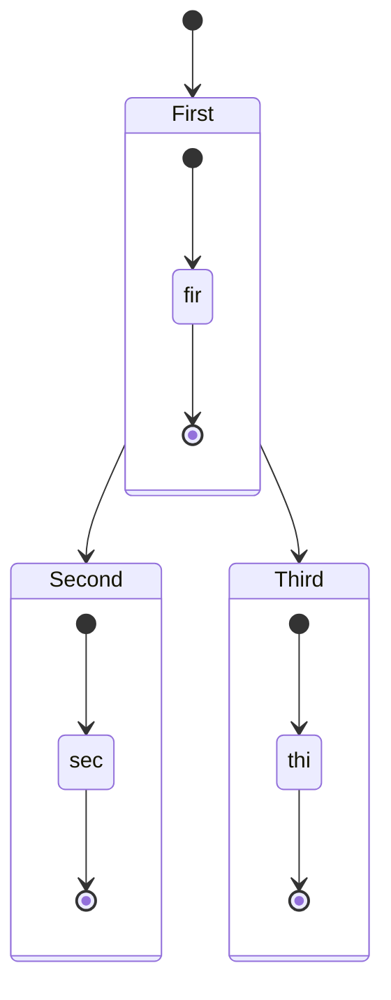

<MermaidPreviewMD chart={`
stateDiagram-v2
    [*] --> First
    First --> Second
    First --> Third

    state First {
        [*] --> fir
        fir --> [*]
    }
    state Second {
        [*] --> sec
        sec --> [*]
    }
    state Third {
        [*] --> thi
        thi --> [*]
    }
`}/>

_You can not define transitions between internal states belonging to different composite states_

## Choice

Sometimes you need to model a choice between two or more paths, you can do so using &lt;&lt;choice&gt;&gt;.

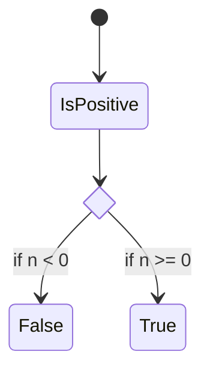

<MermaidPreviewMD chart={`
stateDiagram-v2
    state if_state <<choice>>
    [*] --> IsPositive
    IsPositive --> if_state
    if_state --> False: if n < 0
    if_state --> True : if n >= 0
`}/>

## Forks

It is possible to specify a fork in the diagram using &lt;&lt;fork&gt;&gt; &lt;&lt;join&gt;&gt;.

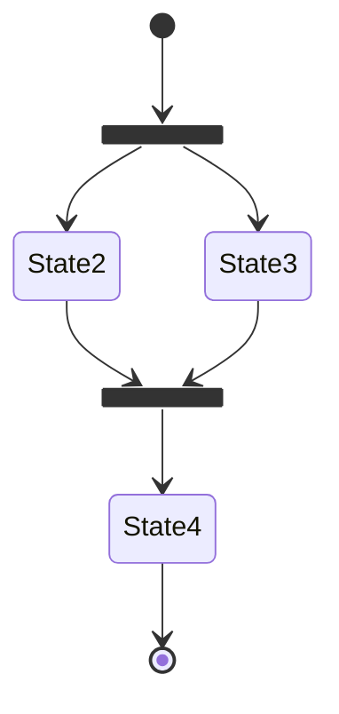

<MermaidPreviewMD chart={`
stateDiagram-v2
    state fork_state <<fork>>
      [*] --> fork_state
      fork_state --> State2
      fork_state --> State3

      state join_state <<join>>
      State2 --> join_state
      State3 --> join_state
      join_state --> State4
      State4 --> [*]
`}/>

## Notes

Sometimes nothing says it better than a Post-it note. That is also the case in state diagrams.

Here you can choose to put the note to the _right of_ or to the _left of_ a node.

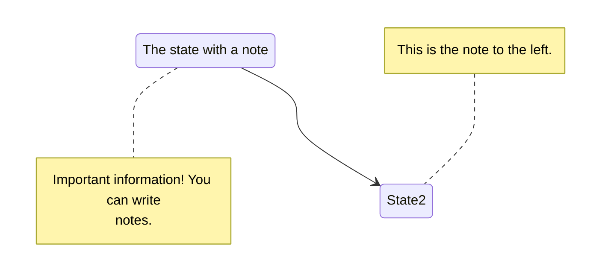

<MermaidPreviewMD chart={`
stateDiagram-v2
    State1: The state with a note
    note right of State1
        Important information! You can write
        notes.
    end note
    State1 --> State2
    note left of State2 : This is the note to the left.
`}/>

## Concurrency

As in plantUml you can specify concurrency using the -- symbol.

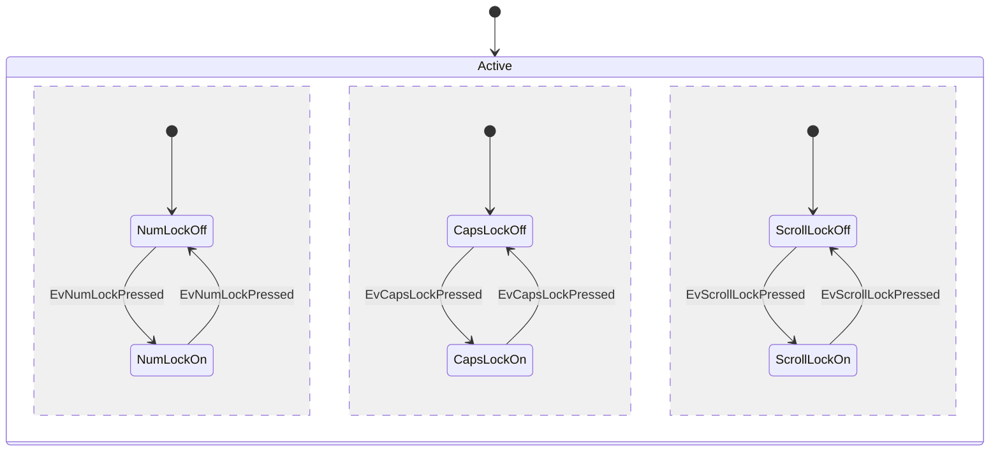

<MermaidPreviewMD chart={`
stateDiagram-v2
    [*] --> Active

    state Active {
        [*] --> NumLockOff
        NumLockOff --> NumLockOn : EvNumLockPressed
        NumLockOn --> NumLockOff : EvNumLockPressed
        --
        [*] --> CapsLockOff
        CapsLockOff --> CapsLockOn : EvCapsLockPressed
        CapsLockOn --> CapsLockOff : EvCapsLockPressed
        --
        [*] --> ScrollLockOff
        ScrollLockOff --> ScrollLockOn : EvScrollLockPressed
        ScrollLockOn --> ScrollLockOff : EvScrollLockPressed
    }
`}/>

## Setting the direction of the diagram

With state diagrams you can use the direction statement to set the direction which the diagram will render like in this
example.

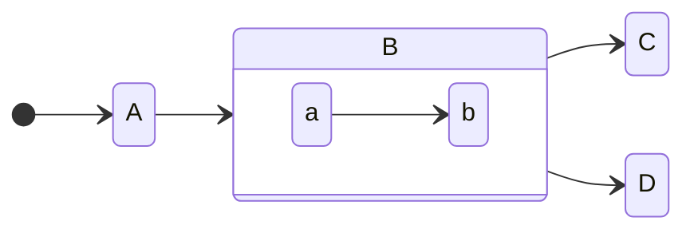

<MermaidPreviewMD chart={`
stateDiagram
    direction LR
    [*] --> A
    A --> B
    B --> C
    state B {
      direction LR
      a --> b
    }
    B --> D
`}/>

## Comments

Comments can be entered within a state diagram chart, which will be ignored by the parser. Comments need to be on their
own line, and must be prefaced with `%%` (double percent signs). Any text after the start of the comment to the next
newline will be treated as a comment, including any diagram syntax

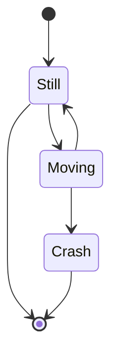

